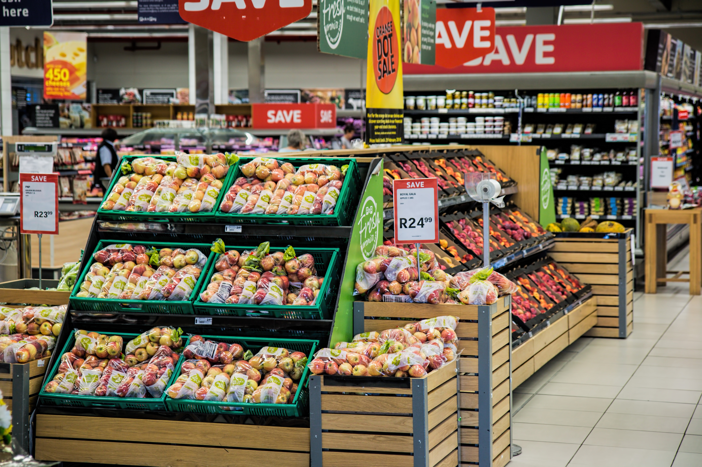
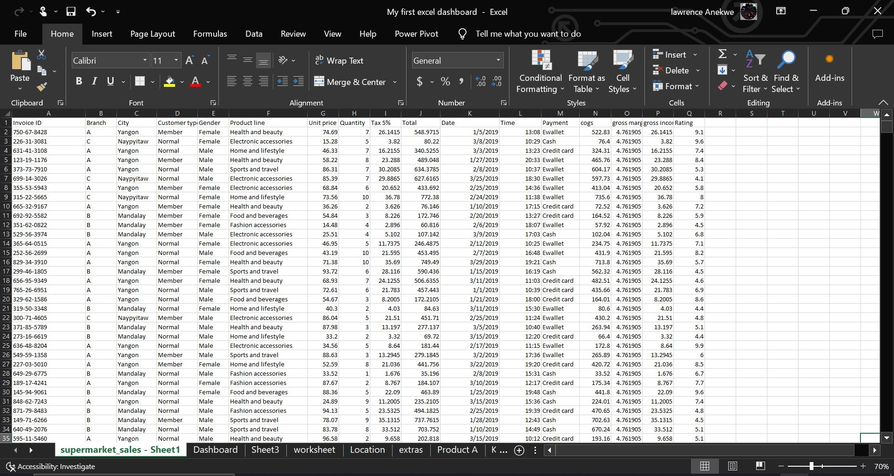
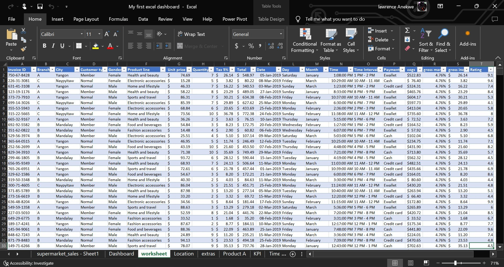

# Supermarket_Sales_Analysisis

## Introduction 
This Excel project focuses on analyzing the sales performance of a supermarket store. It delves into the sales data for the initial quarter of 2019, aiming to extract valuable insights and address various business-related inquiries.  

## Key Questions
 * What is the average rating for the first quarter?
 * What is the total sales count for the first quarter?
 * What is the total revenue generated for the first quarter?
 * What is the total income generated for the first quarter?
 * What is the distribution of revenue across each city?
 * What city is each supercenter located in?
 * What product line generates the highest revenue?
 * What product line generates the least revenue?
 * What day does the supermarket have the most sales?
 * What is the busiest hour of the day?
 * What is the most used payment method?

## Skill Demonstrated
1. Data Cleaning
2. Data Validation
3. Data Analysis
4. Data Visualization

## Data Sourcing
The dataset was sourced from Kaggle.com  
To view the dataset, Click [Here](https://www.kaggle.com/datasets/aungpyaeap/supermarket-sales).  

## Data Cleaning/ Transformation
  I cleaned and transformed the data, aiming to enhance the dataset's clarity and fasten work processes.
   * The columns where assigned the appropriate data type.
   * The date column was changed to a custom format(dd-mmm-yyyy). This is to make the date column easier to understand at a glance.
   * Three new columns were created from the data and time columns using the specified Excel formulas
      1. Day = TEXT(K2,"dddd"),
      2. Month = TEXT(K2,"mmmm")
      3. Time Interval = TEXT(N2, "h AM/PM") & " - " & TEXT(N2+TIME(1,0,0), "h AM/PM")

   Raw Data              |           Cleaned Data
:-----------------------:|:--------------------------:
         |   

 ## Data Visualization/Analysis
I developed an interactive dashboard for viewing insights, complete with filtering options. These filters allow for a more detailed analysis by enabling you to concentrate on specific genders, customer types, months, or days of interest.  

https://github.com/user-attachments/assets/36ee178a-d4c0-4a03-9178-a51e2a3150a0  

From the analysis, I was able to answer the key questions asked;
* The average rating for the first quarter is 7.0, this was gotten by taking the average of the average column.
* In the first quarter of the year 2019, the supermarket saw a total sales count of 1000 across all three supercenters.
* The supermarket made a total revenue of $322,966.76 in the first quarter of 2019.
* The supermarket charges a fixed 5% tax on each purchase, this serves as the income made from each purchase. Over the first quarter, the supermarket has made a $15,379.37 profit. This is obtained by taking the sum of the gross income column.
* The city of Naypyitaw generates the most revenue with the other 2 cities also following closely behind it. This goes to say that the marketing team is performing an amazing job in all 3 cities
* From the sales analysis, I was able to deduce that supercenter A is located at Yangon, supercenter B is located at Mandalay and supercenter C is located at Naypyitaw.
* The food and beverages product line generates the highest revenue. This I feel is due to the fact that as humans we could do away with every other thing, but we must eat.
* The health and beauty product line generates the least revenue 
* Saturday is the day in which the supermarket recorded the highest sales, obviously cause it's the weekend so most individuals come to restock against the coming week.
* The most busy sales hour appears to be from 7 pm to 8 pm. This is reasonable cause most individuals prefer shopping in the evening and workers also get off work around the same time.
* The most used means of payment is Ewallet.
 

## Insights/Recommendations 

Based on the analysis, it's evident that the superstore supercenters are performing quite impressively. However, there are a few areas where making minor changes could potentially lead to an increase in sales thereby increasing income.

* To enhance sales revenue, the supermarket should consider putting more marketing efforts into the least-sold product category, "health and beauty".

* During the busiest day, Saturday, especially during the closing hours (5 pm-8 pm), the supermarket should explore the possibility of hiring additional staff to efficiently handle the large influx of sales.

* Lastly, it's essential for the supermarket to conduct a more in-depth investigation into the reasons behind the ratings, because a further drop to 6.8 occurred in March.

  _Hope you found this insightful._  
  _Thanks for reading😄._

